# gachadata-server
整地鯖のガチャデータを公開するためのサーバー

# 環境変数
| 環境変数名      | 説明                                              | 例       | 
| -------------- | ------------------------------------------------- | -------- | 
| HTTP_PORT      | `gachadata-server`が受け付けるHTTPポート            | 80       | 
| MYSQL_HOST     | ゲームデータがあるMYSQLのホスト名                 | db       | 
| MYSQL_PORT     | ゲームデータがあるMYSQLのポート番号               | 3306     | 
| MYSQL_USER     | ゲームデータがあるMYSQLにアクセスできるユーザー名 | user     | 
| MYSQL_PASSWORD | `MYSQL_USER`で指定したユーザーのパスワード        | password | 

# 俯瞰図

